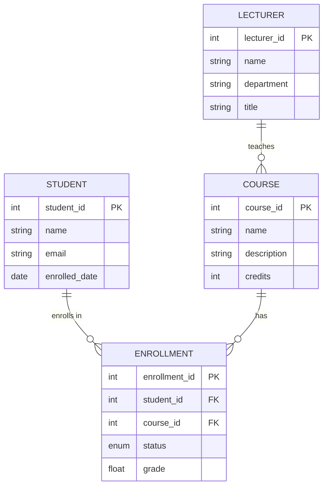

# UniData
[](https://travis-ci.org/[username]/unidata)
[](https://coveralls.io/github/[username]/unidata?branch=master)
[](https://pypi.python.org/pypi/unidata)
[](https://github.com/[username]/unidata/blob/master/LICENSE)

UniData is a comprehensive university management system built using Python and SQLAlchemy. This CLI application provides efficient management of academic resources, student records, course scheduling, and faculty administration.

## Core Features

* Complete student lifecycle management
* Course creation and scheduling
* Faculty management and assignment
* Grade tracking and reporting
* Attendance monitoring
* Resource allocation

## System Architecture

```mermaid
graph TD
    classDef core fill:#ff9999,color:#000000,stroke:#ff6666
    classDef auth fill:#99ff99,color:#000000,stroke:#66ff66
    classDef util fill:#9999ff,color:#000000,stroke:#6666ff
    
    subgraph Core["Core Components"]
        direction TB
        CLI[CLI Interface]:::core
        DB[(Database)]:::core
        Config[Configuration]:::core
    end
    
    subgraph Auth["Authentication Layer"]
        direction TB
        Auth[Auth Manager]:::auth
        Token[Token Handler]:::auth
    end
    
    subgraph Utils["Utility Services"]
        direction TB
        Logger[Logger]:::util
        Validator[Validator]:::util
    end
    
    CLI --> Auth
    Auth --> Token
    Token --> DB
    Config --> CLI
    Logger --> CLI
    Validator --> CLI
    
    %% Legend
    subgraph Legend["Legend"]
        C1[Core Component]:::core
        A1[Auth Component]:::auth
        U1[Util Component]:::util
    end
```

## Database Schema



### Understanding the Relationships

The database schema illustrates several key relationships:

* One-to-many relationship between lecturers and courses (||--o{)
* Many-to-many relationship between students and courses through the ENROLLMENT junction table
* Status tracking for enrollments (pending/current/completed)
* Grade management through the ENROLLMENT entity

## Installation

```bash
pip install unidata
```

## Getting Started

1. Initialize the database:
```bash
unidata init-db
```

2. Add a new student:
```bash
unidata student add --name "John Doe" --email "john@example.com"
```

3. Create a new course:
```bash
unidata course create --name "Introduction to Computer Science" --credits 3
```

4. Assign a lecturer to a course:
```bash
unidata course assign-lecturer --course-id 1 --lecturer-id 1
```

## Usage Examples

### Student Management

```bash
# List all students
unidata student list

# Get student details
unidata student get --student-id 1

# Update student information
unidata student update --student-id 1 --email "john.new@example.com"
```

### Course Management

```bash
# List all courses
unidata course list

# Add enrollment
unidata enrollment add --student-id 1 --course-id 1

# Record grade
unidata enrollment grade --enrollment-id 1 --grade 85.5
```

## Configuration

The application uses a configuration file located at `~/.unidata/config.yml`:

```yaml
database:
  url: "sqlite:///unidata.db"
  echo: false

logging:
  level: INFO
  file: "unidata.log"
```

## Development

1. Clone the repository:
```bash
git clone https://github.com/[username]/unidata.git
```

2. Install dependencies:
```bash
pip install -r requirements.txt
```

3. Run tests:
```bash
pytest tests/
```

## Contributing

Pull requests are welcome! Please:

1. Fork the repository
2. Create a feature branch
3. Write tests for new features
4. Update documentation as needed
5. Submit a pull request

## License

UniData is released under the MIT License. See [LICENSE](LICENSE) for details.

## Acknowledgments

Special thanks to the SQLAlchemy and Click communities for their excellent libraries and documentation.
